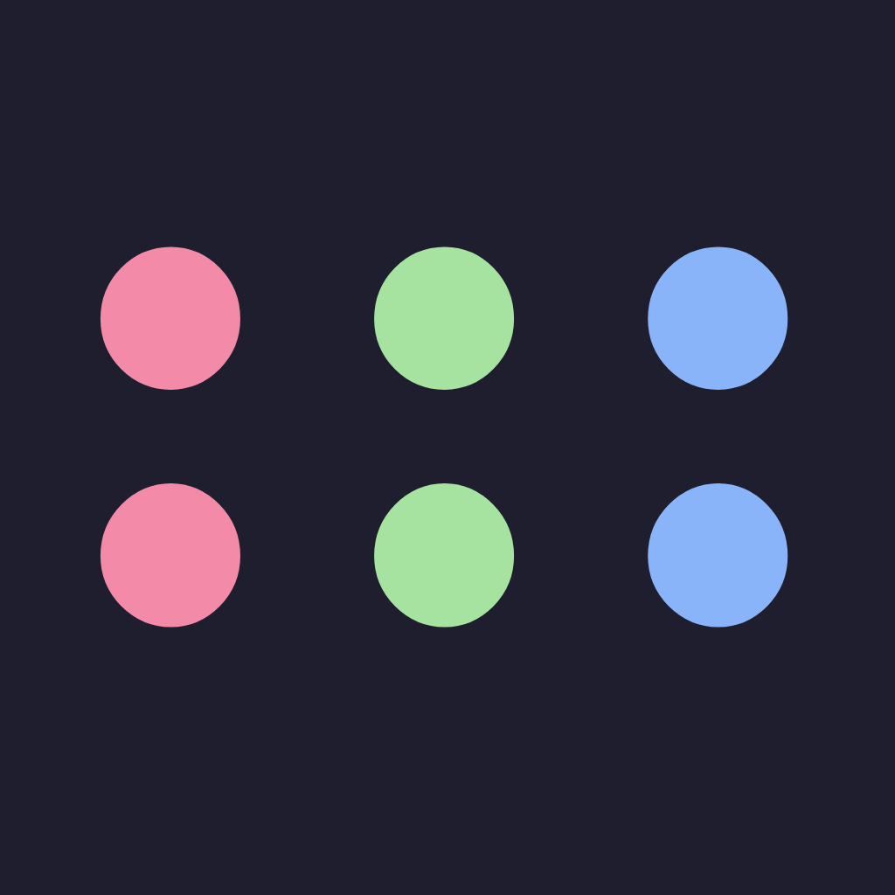

### Hi, I'm Deepak (he/him) 👋

- I am a Fullstack software developer from Sydney Australia.

* 🔭 For most of my career, I have focused on Web development and APIs
* 🌱 I have written code in many programming languages. These days I enjoy writing **TypeScript**, **Python** and **Ruby**
* 📚 Beyond the code, I love reading and have a personal collection of around 800 books. These are my prized possessions.
* 💬 I'm always open to a chat about technology, programming and books.
* ⚡ New Zealand is my favourite country. In New Zealand, there is a city called Auckland, in Auckland there is a suburb called Papatoetoe, in Papatoetoe there is a street called Deepak Lane. Of course it is not named after me, but that's what I tell people. Please keep this a secret.

## Social

## Blog

     
    <a href="https://bitofbinary.com">Bit of Binary</a>

<!--
**dee-kap/dee-kap** is a ✨ _special_ ✨ repository because its `README.md` (this file) appears on your GitHub profile.

Here are some ideas to get you started:

- 🔭 I’m currently working on ...
- 🌱 I’m currently learning ...
- 👯 I’m looking to collaborate on ...
- 🤔 I’m looking for help with ...
- 💬 Ask me about ...
- 📫 How to reach me: ...
- 😄 Pronouns: ...
- ⚡ Fun fact: ...
  -->
